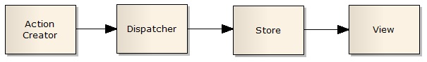

Скрипт призентации «Управление состоянием компонентов в React - приложениях»

### 1. What is React.
React is a declarative, efficient, and flexible JavaScript library for building user interfaces. It lets you compose complex UIs from small and isolated pieces of code called “components”.
```
class Test extends React.Component {
    constructor() {
        this.state = {
            id: 1,
            name: "test"
        };
    }

    render() {
        return (
            <div>
              <p>{this.state.id}</p>
              <p>{this.state.name}</p>
            </div>
        );
    }
}
```

### 2. What is state.
State is a special built-in object, which allows components to create and manage their own data. Components cannot pass data with state, but they can create and manage it internally.
How do you update a component’s state?
State should not be modified directly, but it can be modified with a special method called `setState()`.

```
this.state.id = “2020”; // wrong

this.setState({         // correct
    id: "2020"
});
```

#### Approach #2: Object Spread
Object spread is currently a stage 3 feature, and can be transpiled by Babel. This approach is more concise:

```
updateState(event) {
 const {name, value} = event.target;
 let user = {...this.state.user, [name]: value};
 this.setState({user});
}
```

I’m destructuring event in the method signature to get a reference to event.target. Then I’m declaring that state should be set to a copy of this.state.user with the relevant property set to a new value. I like how terse this is. This is currently my favorite approach to writing change handlers.

What happens when state changes?
OK, why must we use `setState()`? Why do we even need the state object itself?
A change in the state happens based on user-input, triggering an event, and so on. Also, React components (with state) are rendered based on the data in the state. State holds the initial information.
So when state changes, React gets informed and immediately re-renders the DOM – not the whole DOM, but only the component with the updated state. This is one of the reasons why React is fast.
And how does React get notified? You guessed it: with `setState()`. The `setState()` method triggers the re-rendering process for the updated parts. React gets informed, knows which part(s) to change, and does it quickly without re-rendering the whole DOM.
In summary, there are 2 important points we need to pay attention to when using state:
- State shouldn’t be modified directly – the `setState()` should be used
- State affects the performance of your app, and therefore it shouldn’t be used unnecessarily.

Can I use state in every component?
Another important question you might ask about state is where exactly we can use it. In the early days, state could only be used in class components, not in functional components.
That’s why functional components were also known as stateless components. However, after the introduction of React Hooks, state can now be used both in class and functional components.
If your project is not using React Hooks, then you can only use state in class components.
- Components can create and manage their own data with state;
- state is for managing data;
- State data can be modified by its own component, but is private (cannot be accessed from outside);
- Modifying state should happen with the `setState()` method;


### 3. Управление состоянием компонента в условиях архтектуры Flux
Flux is an architectural pattern proposed by Facebook for building SPAs. It suggests to split the application into the following parts:
- Stores;
- Dispatcher;
- Views;
- Action / Action Creators.

#### Store
Store manages the state. It can store both domain state and user interface state.
According to FLUX store and state are different concepts. State is the data value. Store is a behavior object that manages state through methods.
A store manages multiple objects. It is the single source of truth in regards to those specific objects. In an application there can be many stores. For example: BookStore, AuthorStore, UserStore.
There are no setter methods on the store. You can only request state change by passing an action to the dispatcher.
A store listens for all actions and decides on which of them to act. This usually means a switch statement. Once the store has made the state changes, it will emit a change event. The store is an event emitter.
Stores don’t take other stores as dependencies.

#### Dispatcher
Dispatcher is a single object that broadcasts actions/events to all registered stores. Stores need to register for events when the application starts.
When an action comes in, it will pass that action to all registered stores.
View
View is the user interface component. It is responsible for rendering the user interface and for handling the user interaction. Views are in a tree structure.
Views listen for store changes and re-render.
Views can be further split in Presentation and Container Views.
Presentation views don’t connect to dispatcher or stores. They communicate only through their own properties.
Container views are connected to stores and dispatcher. They listen for events from stores and provide the data for presentation components. They get the new data using the stores’ public getter methods and then pass that data down the views tree.
Container views dispatch actions in response to user iteration.

#### Actions
An action is a plain object that contains all information necessary to do that action.
Actions have a type property identifying the action type.
As action objects move around the application, I suggest to make them immutable.
Actions may come from different places. They may come from views as a result of user interaction. They may come from other places like the initialization code, where data may be taken from a Web API and actions are fired to update the views. Action may come from a timer that requires screen updates.

#### Action Creators
The practice is to encapsulate the code, creating actions in functions. These functions that create and dispatch actions are called action creators.

#### Web API Calls
When doing Web API calls to update the user interface, the Web API call will be followed by an action to update the store. When the store is updated it will emit a change event and as result the view that listens for that event will re-render.
Web API calls are made in action creators. Also, we can extract out the code that does the API call in Web API Utils functions.

#### Unidirectional data flow
Updating views flow in a single direction:



Views do not modify the data they received. They listen for changes of this data, create actions with new values, but do not update the data.
Stores, views and any other action can’t change the state in (other) stores directly. They must send an action through the dispatcher
The data flow is shorter in store reads than in writes.The data flow in store writes differs between asynchronous and synchronous actions.
#### Store Reads

#### Store Writes in synchronous actions

#### Store Writes in asynchronous actions

#### Pros
Flux architecture is better in an application where views don’t map directly to domain stores. To put in a different way, when views can create actions that will update many stores and stores can trigger changes that will update many views.
Actions can be persisted and then replayed.
#### Cons
Flux can add unnecessary complexity to an application where each view maps to one store. In this kind of application a separation between view and store is enough.
#### Conclusion
Stores manage state. They change state only by listening for actions. Stores notify views to update.
Views render the user interface and handle user interaction. Container views listen for store changes.
The dispatcher broadcasts actions to all registered stores.
Actions are plain objects.

### 3. Особенности управления состоянием в React – Redux приложении

#### What is Redux?
Redux is an open-source library to improve the predictability of the state in a JavaScript application. It is an independent library. It is commonly used with other libraries like React and Angular for better state management of the application. Redux was created by Dan Abramov in 2015 to handle complex state management in an efficient way.
When an application grows larger it becomes harder to manage the state and debug for issues. It becomes a challenge to track when and where the state is changed and where the changes need to be reflected. Sometimes a user input triggers some API call which updates some model. That model in turn updates some state or maybe the other model and so on.
In such a situation it becomes grinding to track the state changes. It happens mainly because there is no defined rule to update a state and state can be changed from anywhere inside the application.
Redux tries to solve this issue by providing a few simple rules to update the state to keep it predictable. Those rules are the building blocks of Redux.

#### Redux Store:
As we discussed earlier, the main purpose of Redux is to provide predictable state management in our applications. Redux achieves this by having a single source of truth, that is a single state tree. The state tree is a simple JavaScript object which holds the whole state of our application. There are only a few ways to interact with the state. And this makes it easy for us to debug or track our state.
We now have only one main state which occupies the whole state of the application located at a single location. Any changes made into the state tree are reflected in the whole application because this is the only source of data for the app. And, this is the first fundamental principle of Redux.

#### Rule #1 — Single source of truth
The state of your whole application is stored in an object tree within a single store.
The ways you can interact with a state tree are:
- Getting the state;
- Listening to the changes in the state;
- Updating the state.

A store is a single unit that holds the state tree and the methods to interact with the state tree. There is no other way to interact with a state inside the store except through these given methods.

Let’s talk about the methods a store gives us to interact with the state.
- getState() — Returns the current state of the application.
- dispatch(action) — The only way to update a state is by dispatching an action and dispatch(action) serves the purpose.
- subscribe(listener) — The purpose of this method is to listen for the state changes. Every time a state is changed, it will be called and will return the updated state.
- replaceReducer(nextReducer) — Replaces the reducer currently used by the store to calculate the state.

Now when we have a store which contains a state tree and a few ways to interact with the state, how can we update application state?
#### Updating state in the application:
The only way to update a state is to dispatch an action. This is the 2nd rule.

#### Rule #2 — State is read-only
An action is a plain JavaScript object to keep track of the specific event taking place in the application. What makes it special is a ‘type’ property which is a necessary part of it.

```
{  type: "ADD_BOOK_TO_THE_CART"}
```

The main purpose of this property is to let Redux know about the event taking place. This type should be descriptive about the action. Along with the ‘type’ property, it can have other information about the event taking place.
Actions can have as much information as you want. It is a good practice to provide less and only necessary information — preferably an id or any unique identifier wherever possible.
Once we define our action we pass it to the dispatcher. store.dispatch() is a function provided by the library which accepts an action to perform an action against the state. Redux restricts updating the state to this method only.
This strict way of updating the state ensures that the state can not be changed directly either by view or any network callback. The only way to update a state is by defining the action and then dispatching it. Remember that actions are plain JavaScript objects. Actions can be logged, serialized, and replayed for debugging purposes.
We now have a store, a state, and an action in our app to perform some tasks against the state. Now we need a way to use these actions to actually do the update. This can be done by using a pure function and this is rule #3.


#### Rule#3 — Changes are made with pure functions
Magic happens here. We need a simple pure function, which, as a parameter, takes the current state of the application and an action to perform on the state, and then returns the updated state. These functions are called reducers.
These are called reducers because they take the collection of values, reduce it to an updated state and then return it. Since reducers are pure functions they do not mutate the original state. Instead, they return the updated state in a new object. Our application can have one or more than one reducer. Each reducer can have a relevant state to perform specific tasks.
Since reducers are pure functions, they should have the following attributes:
- Given the same input, it should return the same output every time — No mutation is allowed.
- No side effects — No API call data change from an external source.

#### The process.
If we connect the dots, Redux is a library which has a store that contains a state tree and a few methods to interact with the state. The only way to update a state inside a store is to dispatch an action and define a reducer function to perform tasks based on the given actions. Once dispatched, the action goes inside the reducer functions which performs the tasks and return the updated state to the store. This is what Redux is all about.
State update flow in Redux.

### Conclusion:
Was shown that…